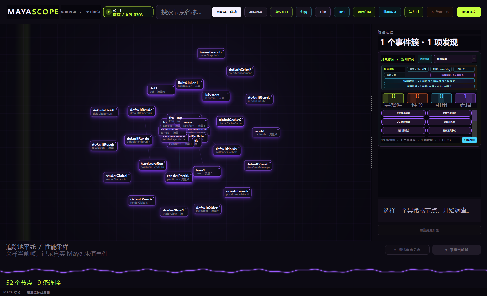
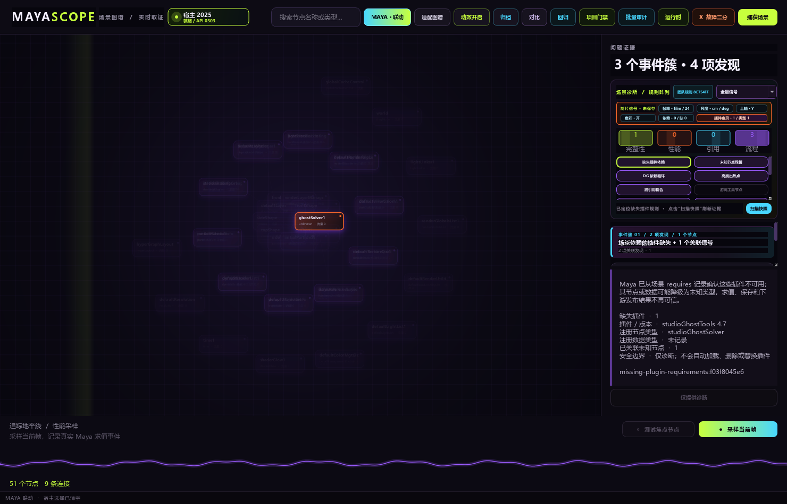
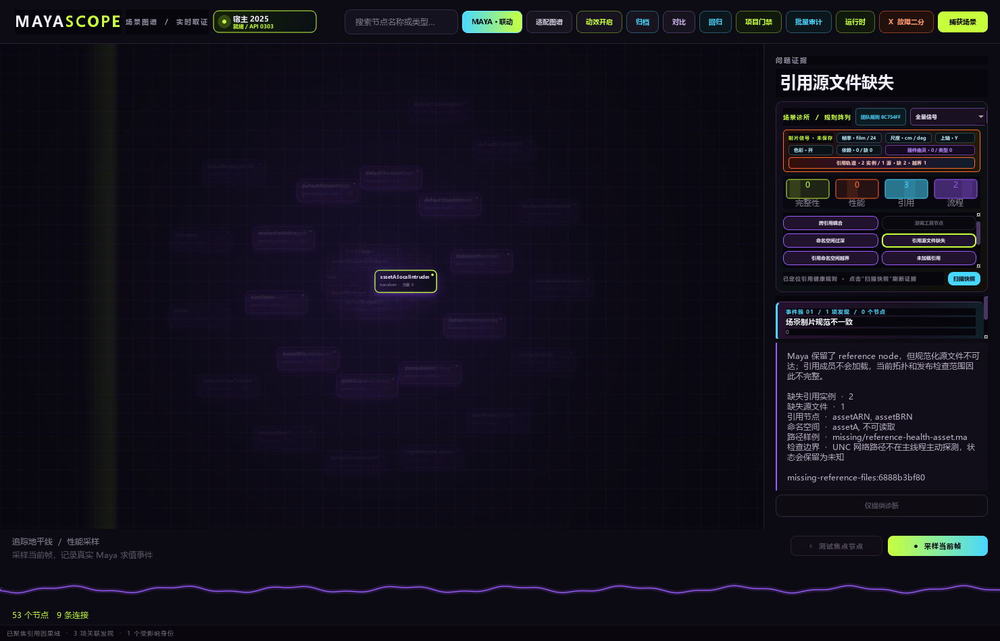
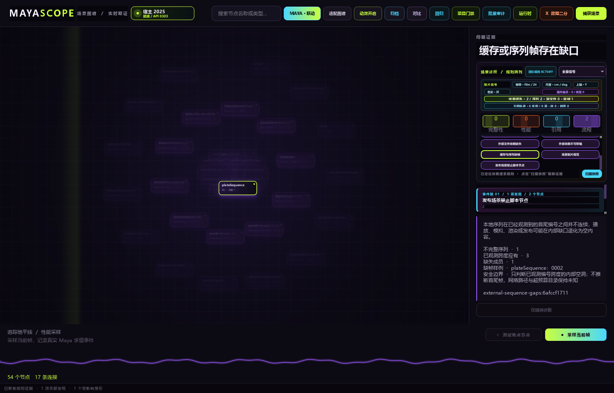

# MayaScope

面向 Autodesk Maya Technical Director 的场景理解、诊断、性能分析和安全操作平台。MayaScope 的长期目标是把 DAG、DG、Evaluation、Profiler、引用、插件和运行时状态组织成可查询、可解释、可交互的场景模型，而不是继续堆叠独立脚本。



上图来自一个由测试启动并精确持有 PID 的真实 Maya 2025 GUI 进程，不是独立 Qt 仿制窗口：
`MayaScopeSpectralWorkspace` 的父窗口实际为 `MayaWindow`。探针同时验证重复启动、开发热重载、
选择回调、动态计时器、菜单卸载和宿主退出；测试完成后只结束自己创建的 Maya，保留启动前已有会话。

当前 Maya 2025 展示版已经走通 Scene Atlas、Root Cause Lens、Scene Clinic、引用/插件/依赖取证、
签名 Audit、可恢复批量发布队列和安全 ChangePlan 等核心路径；旧 Inspector、Node Assistant 与 Set
Manager 已隔离在兼容入口和 `legacy/`，不再主导产品结构。v1 生产化仍在持续推进，当前可下载包、
校验清单与版本说明见 [GitHub Releases](https://github.com/Ubik42/MayaScope/releases)。完整路线见
[`docs/DEVELOPMENT_PLAN.md`](docs/DEVELOPMENT_PLAN.md)，产品研究见
[`docs/RESEARCH_TD_PRODUCT.md`](docs/RESEARCH_TD_PRODUCT.md)。

## 启动新版调查工作区

当前展示版以 **Maya 2025 + PySide6** 为唯一宿主基线。把 `D:\\3D\\_tools` 加入 Maya 的 Python 路径，然后执行：

```python
from MayaScope import launch
launch.run()  # 启动 Spectral Scene Atlas
```

首次启动 Observatory 会幂等创建会话级 `MayaScope` 主菜单，不写 Preferences。顶栏
**Host Beacon** 会即时、只读显示 Maya 版本/API 与 Runner 边界；点击后在 Evidence Rail 展示
PySide、Evaluation、Module 和 mayapy 详情。窄屏会收起 Beacon，而不是压缩主要操作。

也可以使用不会修改 `userSetup.py` 的用户级 Maya Module 安装器；完整恢复说明见
[`docs/OPERATIONS.md`](docs/OPERATIONS.md)。

```powershell
python -m MayaScope.install install
python -m MayaScope.doctor
```

显式 Shelf 安装和真实展示场景说明见 [`docs/SHOWCASE.md`](docs/SHOWCASE.md)。

发布前可运行一次独立的真实 GUI 生命周期验证；它使用隔离 `MAYA_APP_DIR`、隐藏窗口和精确 PID
回收，不附着已有 Maya：

```powershell
python -m MayaScope.gui_lifecycle `
  --maya "C:\Program Files\Autodesk\Maya2025\bin\maya.exe" `
  --output mayascope-gui-lifecycle.json `
  --screenshot mayascope-real-maya-gui.png
```

Scene Clinic 也可作为只读 CI / 发布门禁运行。它只启动一个隐藏 Maya 2025 进程，打开场景时
禁用 script node 执行，并在前后校验源文件 SHA-256：

```powershell
python -m MayaScope.audit D:\shots\shot010.ma --profile publish --fail-on error --report clinic-audit.json --summary
python -m MayaScope.audit --verify-report clinic-audit.json
```

退出码 `0` 表示通过，`2` 表示发现达到阈值的问题，`1` 表示配置、规则或宿主失败；带校验和的
完整报告仍写入 `--report`，`--summary` 只压缩终端输出，不丢弃证据。

多个场景报告可汇总为一个自包含、可离线复核的项目审计包。聚合器先验证每份场景签名，再要求
Profile、规则配置指纹、Maya 版本/API 与工作区完全一致；重复场景或混用上下文直接拒绝。项目包
内嵌原始签名报告并增加第二层 SHA-256，汇总场景通过率、严重级别、规则与原子 Finding：

```powershell
python -m MayaScope.project_audit build shot010.json shot020.json `
  --report project-audit.json --summary
python -m MayaScope.project_audit verify project-audit.json --summary
```

顶栏 **项目门禁** 只打开校验成功的项目包。动态“项目发布列车”把每个场景绘制为可点击审计舱，
通过/阻断、问题数与原子发现均来自真实报告；点击场景会把双层签名和严重级统计送入问题证据栏。

若还没有单场景报告，可先创建带源文件/配置哈希的批量计划，再由严格串行队列在后台逐场景运行。
计划、断点日志、单场景报告和最终项目包都有独立签名；`run` 可直接用于首次执行或断点恢复：

```powershell
python -m MayaScope.project_queue create shot010.ma shot020.ma --plan publish-plan.json `
  --profile publish --fail-on error --config clinic.team.json --workspace D:\show
python -m MayaScope.project_queue run publish-plan.json --journal publish-queue.json `
  --report-dir audit-reports --project-report project-audit.json
python -m MayaScope.project_queue verify publish-queue.json --plan publish-plan.json
```

Maya 顶栏 **批量审计** 会在独立线程中驱动隐藏 mayapy，界面保持可交互。“安全暂停”只在当前
场景结束后停止；继续时已验证通过/阻断的报告不会重复运行，异常中断的 `运行中` 任务会恢复为
`待运行`，失败原因、尝试次数和恢复次数全部进入签名日志。

队列还具有操作系统级单所有者锁、可读租约/心跳和启动前磁盘容量预检。同一断点不会被两个
MayaScope 同时消费；Windows 下每个 mayapy 进入“父进程关闭即回收”的 Job Object。若旧版本或
异常环境留下孤儿，恢复器只会在 PID、启动时刻、可执行文件、计划签名和日志路径全部精确匹配时
终止它，拒绝按进程名扫杀。容量、后台 PID 与崩溃联动状态实时显示在中文项目发布列车中。

需要判断“相对已批准版本是否退化”时，可把任意已校验报告直接作为签名基线。性能采样是显式
opt-in：它在隐藏 Maya 中交替相邻时间样本，dirty 全场景并 demand-pull 几何输出，最后恢复原时间；
不依赖无头环境中无效的 viewport refresh，也不把嵌套 Profiler 事件相加。

```powershell
# 首次建立绝对基线（场景已有错误时仍会按绝对门槛返回 2）
python -m MayaScope.audit D:\shots\shot010.ma --profile publish --fail-on error `
  --performance-samples 7 --report clinic-baseline.json --summary

# 后续只阻断新增/加重的 Finding 或越过比例、绝对值和噪声带的性能退化
python -m MayaScope.audit D:\shots\shot010.ma --profile publish --fail-on error `
  --baseline-report clinic-baseline.json --gate-mode regression `
  --max-slowdown 0.20 --min-slowdown-ms 2 --report clinic-regression.json --summary
```

Workspace 顶栏 **回归** 可打开带校验和的 regression report。动态裂隙带会并排绘制基线/当前
evaluation 样本，并把新增、加重、解决的稳定 Finding 和实际门禁理由送入 Evidence Rail。
聚合 Issue 还携带稳定原子主体：外部依赖按 dependency id、场景契约按字段分别比较；同一节点
新增第二条缺失路径不会被已有 Finding 吞掉。场景级 Finding 回退到稳定 Issue id，不再全部塌缩为
一个 `<scene>`。工作区和关键场景设置不同的报告会拒绝性能/质量比较。

Snapshot 与 Audit payload 使用显式逐级 schema migration。旧文件始终先按原始内容验证校验和，
再迁移内存副本；不会静默改写历史 artifact。未来版本、缺失迁移步骤或没有严格推进 `N → N+1`
的迁移会直接拒绝。当前 Snapshot 为 schema 8，Audit 为 schema 2，并保留真实旧版回归夹具。

## Runtime Observatory

顶栏 `RUNTIME` 会在当前不可变 SceneSnapshot 上启动可取消的 7 ms 分片扫描，建立独立
`RuntimeSnapshot`：

- expression：稳定节点身份、object、alwaysEvaluate、unit conversion、源码长度、短预览与 SHA-256；
- scriptJob：interactive Maya 中的 job id、trigger、lifetime flags 和 descriptor hash；batch/standalone
  会明确标记 `unavailable`，绝不把不可观测误写成 0；
- plugin：路径、vendor、version、API、autoload、unload boundary、注册节点与命令；
- callback：使用 Maya 公开 API 统计节点级 opaque callback IDs。Maya 不提供全局 owner/function
  枚举，因此证据只说明 footprint，不做虚假归因。

扫描前后会复核 scene identity、节点拓扑、expression、plugin 和 scriptJob 清单；用户取消或场景
变化会立即移除 mutation guards 并拒绝混合快照。完成后 **Runtime Constellation** 用四条动态轨道
显示 execution surface，并把可归属 expression/callback 节点反向点亮到 Atlas。所有 Runtime
Finding 都是诊断性的：MayaScope 不会自动 kill scriptJob、remove callback 或 unload plugin。

隐藏 Scene Clinic Audit 同样包含 RuntimeSnapshot 与 Runtime Finding。打开场景时继续使用
`executeScriptNodes=False`；batch 中无法获取的 interactive scriptJob 会进入 limitations，而不是
被当作发布干净证据。

## Query Kernel

SceneSnapshot 的 DG 查询由共享 Query Kernel 承担：节点身份只存一次，正反邻接使用整数 CSR，
并行 Plug 连接仍保留完整证据。Clinic 在后台线程预热索引，Root Cause Lens 不在第一次点击时
重建全图。邻域查询具有节点数、边数、深度、deadline 与取消边界，并使用有界 LRU 缓存；新快照
可显式失效，不会把相同 snapshot id 的不同对象串在一起。

Lens Ribbon 会实时显示 `N / E / ms` 与 `NODE-BUDGET`、`EDGE-BUDGET` 或 `DEADLINE` 截断原因。
本机确定性基准的 100,000 / 1,000,000 条边均为唯一邻接；百万边索引约 0.93 s、32.25 MiB，
5,000 节点受限冷查询约 2.09 ms，缓存命中约 0.009 ms。发布输出中的
`query-kernel-benchmark.json` 保存完整机器证据；这些数字是合成拓扑基准，不冒充真实制作场景
端到端采集耗时。

Atlas 的 240 节点限制现在是可换页的语义渲染窗口，不再是捕获时永久丢弃低信号节点。Clinic
在后台同时预计算全关系索引与稳定高流量排名；前台只创建固定数量图元。Lens、Profiler、Delta
或 Runtime 指向被折叠节点时，会增量复用现有图元并把焦点/路径换入窗口。100,000 节点、
1,000,000 唯一边的 Maya 2025 离屏基准为前台应用约 63.5 ms、折叠焦点换入约 32.8 ms，
渲染节点始终不超过 240；完整证据见 `atlas-virtualization-benchmark.json`。

重复捕获现在会在 collector 封口前按稳定 ID 对不可变 payload 做精确 reconciliation。完全相同的
SceneNode、SceneReference 会复用对象；只有节点顺序与完整 Plug/关系 edge tuple 严格一致时才共享
拓扑并把已有 DG / DG+DAG CSR 别名到新 Snapshot。属性变化仍产生新节点证据和 Delta，rewire、
改名导致的 Plug 变化或连接重排都会拒绝 alias 并重建。工作区在普通状态与自动 Root Cause Lens
状态中持续显示 `CSR REUSED`，不会让自动聚焦覆盖增量反馈。

100,000 节点 / 1,000,000 边模型基准中，两个索引 alias 为 8.1 ms，随后 Clinic 预热为 0.029 ms；
单边 rewire 的 alias 数为 0，并重新构建索引。真实 Maya 2025 的 801 节点场景同时覆盖 unchanged、
attribute-only 与 rewire 三条路径，证据分别保存于 `incremental-million-benchmark.json` 与
`incremental-capture-benchmark.json`。

快照绑定证据具有明确生命周期：应用新 Snapshot 会使旧 Runtime inventory、Regression payload、
Counterfactual observations、Profiler capture、Lens 与 Delta 失效，并清空隐藏子控件内部的大型 payload。
Runtime 聚焦还会复核 `source_snapshot_id`，拒绝跨快照展示。关闭 Workspace 会停止所有动态计时器、
清空 Atlas 图元并释放全局 Query Kernel；100 次连续未变化捕获的缓存仍严格保持两个最新逻辑索引。

当前纵向切片会采集不可变的 DG/DAG `SceneSnapshot` 以及第一类 `SceneReference` 记录，在动态 Atlas 中呈现高信号拓扑。除 unknown 节点、依赖环、高扇出和跨引用耦合外，Clinic 也能识别卸载引用、failed reference edits、过深引用链、未保存场景、运行时 script 节点与脱离连接的动画曲线。

Snapshot schema 6 把 Maya 场景保留的未知插件登记建模为一等证据：插件名、版本、注册节点类型、
注册数据类型，以及每个 unknown 节点的原插件与原始类名。`missing-plugin-requirements` 先报告缺失
插件这个根因，`unknown-nodes` 再报告已经降级的节点结果；两个 Finding 通过稳定节点身份聚成同一
事件簇。中文制片信号带新增可点击 **插件幽灵**，能定位规则、点亮受影响 Atlas 节点，并把插件
登记的新增、消失和版本/类型变化带入 Scene Delta 与签名 Audit。



Snapshot schema 7 继续把文件引用解析升级为生产证据：保留 Maya 带 `{N}` 的实例路径、原始路径、
`withoutCopyNumber` 规范化源文件、复制编号、源文件存在状态、namespace、加载状态和成员稳定身份。
同一资产多次引用被正确归并为一个源文件，不会因为 `{1}` 被误报重复；真正缺失的源文件由
`missing-reference-files` 阻断发布，本地节点侵入引用 namespace 则由
`reference-namespace-intrusion` 精确定位。可点击 **引用轨道** 会同时打开最高风险证据，并把同一
因果域中的 namespace 越界节点点亮到 Atlas。



Snapshot schema 8 增加缓存与序列成员清单。MayaScope 会识别 `<UDIM>`、`<UVTILE>`、`<f>`、
`####` 与 `%04d`，在严格的单层目录、条目数和时间预算内统计本地成员。帧序列只判断已经观测到的
首尾编号之间是否存在内部空洞，不依赖可能被安全 Audit 禁用的 Maya UI scriptNode，也不臆测
首尾帧；网络路径、环境变量路径与超预算目录保持未知。可点击 **依赖谱系** 会把缺文件、序列数和
确定缺帧直接联动到规则证据及 Atlas 节点。



Snapshot schema 8 还把 Maya `filePathEditor` 注册的外部文件作为第一类依赖：纹理、图像平面、
音频、缓存、Alembic、USD、GPU Cache 与插件注册路径会绑定到稳定节点身份，保留原始/解析路径、
Maya 存在状态、工作区归属和 `<UDIM>` / `<f>` / `####` 等序列标记。采集不递归打开目录或读取
文件内容，避免主线程触碰大目录与网络共享。Clinic 会确定性报告缺失文件、已观测序列内部空洞，
并以高置信规则提示工作区外绝对路径和网络路径；“依赖谱系”实时显示依赖、序列、缺文件和缺帧，
Delta 和签名 Audit 同步保留每项序列清单及扫描边界。

Snapshot schema 5 进一步区分磁盘场景与 Maya 内存状态：是否存在未保存修改、文件类型、工作区、
当前时间、播放范围和动画范围都进入 `SceneLifecycle`。未保存修改会产生中文 Finding，并把制片
信号带切换为橙色“未保存”状态。隐藏 Audit 支持 `--workspace`；未显式提供时先向上查找
`workspace.mel`，再回退到场景目录，避免临时 `MAYA_APP_DIR` 导致路径可移植性误报。

顶部 **MAYA · 联动** 默认建立 Maya 与 Atlas 的双向选择桥。Maya 的 `SelectionChanged`
经过 45 ms 去抖后按长 DAG 路径或唯一节点名映射到稳定 ID；Atlas 点击会写回 Maya，写回产生的
回调会被精确抑制，不形成反馈环。十万节点身份索引在 Clinic 后台只构建一次，UI 每次选择只做
O(选择数) 查询；关闭工作区或关闭联动会立即移除 Maya callback。

选择 Atlas 节点或在 Maya 中选择节点，会自动打开 **根因透镜**：

- `UPSTREAM` 追踪症状的结构性来源，`IMPACT` 查看下游影响域；
- 根据 DG 距离、分支影响、节点类型、现有 Issue 与 Reference 边界排列候选；
- 每个候选都展示实际节点路径、Plug 连接和评分构成；
- “Structural Signal”只代表结构调查优先级，不冒充 Profiler 测量结果或根因概率；
- 支持深度调整、候选键盘导航、Maya 双向选择和静态 reduced-motion 模式。

底部 **追踪地平线** 已接入 Maya 2025 的真实 Profiler，而不是装饰波形：

- `PROFILE FRAME` 显式采样一次 DG dirty + viewport refresh，并保证采样状态在成功或失败后复原；
- Profiler v2 事件被解析为带线程、CPU、类别、时间与稳定节点身份的 `ProfilerCapture`；
- 事件按主要类别形成光谱轨道，可拖动选择时间窗，双击恢复全范围；
- 所选时间窗会把节点活动热度回灌到 Atlas，并按观察到的包含耗时重新排列 Root Cause 候选；
- 测量证据同时展示事件数、映射覆盖率和路径包含耗时，并明确提示嵌套事件可能重叠，不能直接等同于优化收益。

聚焦本地节点后可使用 `TEST FOCUS` 启动 **Counterfactual Profiler**：

- 预览后临时把目标 `nodeState` 从 Normal 切到 HasNoEffect，引用节点、锁定属性和身份漂移会在采样前拒绝；
- baseline / variant 采用成对 AB/BA 交替顺序，分别热身并重复采样，降低缓存与时间漂移偏差；
- 因果结论使用完整求值 wall-clock，报告均值、p95、噪声和 paired-bootstrap 95% 区间；区间跨零时明确显示 `INCONCLUSIVE`；
- Profiler 节点耗时只作为可重叠的解释信号，以绿/橙差异热度回灌 Atlas，不冒充可相加的优化收益；
- 实验可在样本间取消；成功、失败或取消都会恢复原始 nodeState、停止 Profiler 并保持 Maya Undo 栈顶不变；
- 结果自动写入带 SHA-256 校验和的原子 gzip 证据档案 `%LOCALAPPDATA%\MayaScope\experiments`。

连续两次 `CAPTURE SCENE` 会出现 **Delta Field**，按稳定 UUID 区分新增、删除、重命名、属性变化、连接增删与真正的 rewire；Reference 的加载状态、文件版本、namespace、父级链和 failed edits 也会形成独立的 Reference Delta，而不是被节点增删噪声淹没。`ARCHIVE` 会把当前快照以 gzip + SHA-256 校验和原子保存到 `%LOCALAPPDATA%\MayaScope\snapshots`；`COMPARE` 可以加载历史快照，与当前捕获进行只读比较。写入只会在用户显式点击 Archive 时发生。

右侧 **Scene Clinic / Rule Array** 已开始承担规则运行与安全修复工作流：

- 每条规则声明类别、置信度、扫描成本与修复属性，可在冻结快照上启用、停用并重新扫描；
- 单条规则异常会被隔离并显示为 Rule Fault，其余规则继续运行，失败不会伪装成“场景干净”；
- 四条动态光谱通道显示 integrity、performance、references 与 pipeline 的命中状态；
- `All Signals`、`Rig Surgery`、`Animation Pulse` 与 `Publish Intake` 会切换真正不同的规则集合，而不只是改变标题；
- Finding 会依据共享稳定节点、Reference、Namespace 与直接 DG 邻接聚合成可解释 Incident；点击 Incident 可一次聚焦完整影响域，并把其中可修复 Finding 合成为按稳定身份去重的批量 ChangePlan；
- 规则运行记录单项耗时，Issue 卡直接展示规则契约并联动 Atlas 证据；
- 单项和批量 ChangePlan 都在一个 Undo chunk 内重新校验 UUID、引用边界和执行后置条件，随后重新采集并逐项验证源 Finding 是否消失；
- 只有 Maya Undo 栈顶仍精确匹配该 ChangePlan 时才开放一键回滚，避免误撤销用户后续操作。

团队规则可以通过严格 JSON 部署。设置 `MAYASCOPE_CLINIC_CONFIG` 指向配置文件后，
规则阵列会显示 `团队规则 <SHA-256 指纹>`；错误配置整体回退为内置规则并显示
`配置已回退`，不会半应用。JSON 支持白名单阈值、禁用项、声明式节点类型策略、Profile 与
场景制片契约，不导入或执行 Python。制片契约可约束允许的时间单位、线性/角度单位、上轴、
色彩管理、渲染空间及必要/禁用插件；没有配置时不臆测工作室标准，也不会产生误报。
当前设置通过诊所顶部的动态“制片信号”带持续可见，并进入 Snapshot v3、Delta 与签名 Audit。
需要任意 Python 逻辑的工作室扩展必须显式构造受信
`RulePack` 并把新的 `ClinicEnvironment` 传给 `show_tool()`。完整契约、示例与信任边界见
`docs/CLINIC_RULE_SDK.md` 和 `examples/clinic.team.json`。

## Crash Bisect / Failure Prism（开发中）

点击顶栏 `X BISECT` 会先展示只读计划，再打开动态 **Failure Prism**。经典 `ddmin` 会调度
subset / complement 实验；PASS、FAIL、UNRESOLVED、最后阶段、候选集大小与收缩轨迹会在
Prism 中实时呈现。每次 Probe 都重新核对源 SHA-256，复制到独立 attempt 目录，并且只启动
一个隐藏的 Maya 2025 `mayapy` 进程；取消会在当前 Probe 安全退出后生效，不会留下并发 Maya。
每个 Probe 完成后都会原子更新带校验和的 `bisect-journal.json`；取消或宿主中断后，Failure
Prism 的 `RESUME BISECT` 会重放已验证结果，只为缺失候选集继续启动 Maya，并延续 attempt 序号。

对于 `.ma`，Runner 会在 Maya 打开前解析语句、DAG ownership 和 Reference，生成只包含候选
子集的安全 ASCII 副本，因此可对初始 open timeout/crash 做真正的预打开隔离。故障注入实测已
从四个候选中自动收敛到单个 `poison_GRP`，源内容与哈希保持不变。对于 `.mb`，能力边界仍是
**post-open evaluate/save/reopen isolation**：二进制文件不能安全文本预切片，因此不宣称能
隔离初始打开崩溃。退出码、超时、最后阶段、stdout/stderr 尾部与 crash artifacts 最终汇入
原子写入、带 SHA-256 校验的 Repro Capsule。

批处理入口输出 JSON Lines，适合 CI、农场日志和外部调度器。当前无宿主规划支持 `.ma`；`.mb`
必须先在 Maya 中捕获 Snapshot，避免假装能安全解析二进制场景。

```powershell
python -m MayaScope.runner run D:\shots\broken.ma --root D:\diagnostics\shot010
python -m MayaScope.runner resume D:\diagnostics\shot010\bisect-journal.json
python -m MayaScope.runner verify D:\diagnostics\shot010\repro-capsule.json
```

退出码 `0` 表示调查完整或校验通过，`2` 表示调查得到可恢复的部分结果，`1` 表示配置、校验
或执行错误。Capsule 会记录真实 Maya 版本/API、操作系统、Evaluation 模式、场景单位及已加载
插件，但绝不会为收集清单而额外加载插件。

核心分析不依赖 Maya。Maya 导入只存在于采集器和执行器边界，因此快照、图算法、规则和修改计划都能用普通 Python 快速测试。
Windows 离屏宿主会优先显式装载微软雅黑 / 等线并以 Segoe UI 回退，保证中文自动截图与真实 Maya 界面的文字渲染一致。

## 当前原型一览

| 工具 | 入口 | 用途 |
| --- | --- | --- |
| Hierarchy Inspector | `analyze_scene.py` | 检查场景层级、驱动关系与锁定属性，并导出 Markdown |
| Node Graph Assistant | `node_viewer.py` | 整理 Maya Node Editor、追踪连接并导出 Markdown / Mermaid |
| Set Manager Pro | `set_manager.py` | 创建、检查和整理 Maya Object Set |
| Python Project Analyzer | `py_analyzer.py` | 静态分析 Python 项目结构，生成类、函数与目录报告 |
| Advanced Skeleton Parser | `AnalyseAdv/` | 从大型 MEL 文件提取全局过程并按人工分类重排 |
| MEL Outline | `mel-outline/` | 为 VS Code 提供 MEL 符号、折叠、定义与引用导航 |

## Maya 场景与节点工具

### Hierarchy Inspector

`analyze_scene.py` 将 Maya 场景整理成可筛选的树形结构：

- 按名称搜索，按 transform、joint、constraint、utility/math 等类型筛选；
- 显示节点类型、锁定属性和上游驱动信息；
- 可切换 utility / math 节点的显示；
- 展开、折叠和刷新场景树；
- 将全部可见节点或当前选择复制成 Markdown，便于问题记录和技术沟通。

推荐把仓库父目录加入 `PYTHONPATH`，然后在 Maya Script Editor 的 Python 标签页运行：

```python
from MayaScope import launch
launch.run("hierarchy")
```

### Node Graph Assistant

`node_viewer.py` 直接操作当前 Maya Node Editor：

- 将选中节点设为当前图的起点；
- 添加或移除输入、输出节点；
- 从图中清理 `objectSet` 节点；
- 递归追踪 utility、math 与 matrix 连接；
- 将连接关系输出为 Markdown 表格或 Mermaid 图；
- 复制分析结果到系统剪贴板。

运行：

```python
from MayaScope import launch
launch.run("nodes")
```

### Set Manager Pro

`set_manager.py` 提供 Maya Set 的集中管理界面：

- 创建单个 Set，或按所选对象类型批量创建；
- 将对象加入、移出指定 Set；
- 随 Maya 当前选择实时显示对象所属 Set；
- 使用 Maya Set 的颜色信息辅助辨认。

运行：

```python
from MayaScope import launch
launch.run("sets")
```

## 代码分析与 MEL 导航

### Python Project Analyzer

`py_analyzer.py` 是一个基于 Tkinter 与 Python AST 的独立桌面工具，不依赖 Maya。它可以选择文件或目录，递归识别 Python 包，列出类、方法、顶层函数及其签名，并生成项目目录树。

```powershell
python py_analyzer.py
```

### Advanced Skeleton Parser

`AnalyseAdv/categorize_mel.py` 面向体量较大的 MEL 单文件：

1. 读取人工维护的过程分类表；
2. 解析源文件中的 `global proc`，避开块注释等干扰；
3. 按分类重新组织过程，并加入 `#region` / `#endregion`；
4. 将未命中的过程统一保留在 `Uncategorized` 区域。

仓库中保留了原始输入、分类表、过程清单和重排后的 MEL，便于核对处理结果。

### MEL Outline（实验性）

`mel-outline/` 是一个独立的 VS Code 扩展工程，当前代码提供：

- MEL 文档符号与 Outline；
- `#region` 折叠；
- `global proc` 的定义跳转与引用查找；
- CodeLens 引用入口；
- 导出全局过程列表命令。

开发运行方式见 [`mel-outline/README.md`](mel-outline/README.md)。该扩展目前是源码级实验项目，仓库没有提供已打包的 VSIX。

## 环境与安装

- Maya 工具：当前展示版以 Autodesk Maya 2025.3 + PySide6 为唯一验证基线；
- Python Project Analyzer：Python 3，Tkinter；
- MEL Outline：VS Code 1.106+，Node.js 与 npm。

将仓库的父目录加入 `PYTHONPATH` 后即可使用统一入口。`launch.py` 本身可在普通 Python 中导入，但实际 UI 工具直接调用 `maya.cmds` 和当前 Maya UI，必须从 Maya 内启动。统一入口会清理同一工具的旧窗口，并可用 `launch.close_all()` 一次关闭全部已加载窗口。

## 仓库结构

```text
analyze_scene.py        场景层级检查与 Markdown 导出
node_viewer.py          Node Editor 辅助与连接图导出
set_manager.py          Object Set 管理
launch.py               Maya 工具统一、延迟加载入口
qt_compat.py            Maya 2025 / PySide6 UI 边界
model/profiler.py       ProfilerCapture 与事件数据契约
analysis/pulse.py       Profiler v2 解析、时间窗与节点热度聚合
analysis/measured_lens.py  测量证据与结构因果候选融合
analysis/clinic.py      可扩展规则注册、契约校验与故障隔离
analysis/incidents.py   可解释的 Finding → Incident 聚类
analysis/config.py      严格团队 JSON、指纹和安全回退
analysis/sdk.py         显式受信的版本化 Python RulePack 边界
collectors/maya_profiler.py Maya 2025 Profiler 会话边界
py_analyzer.py          独立 Python 项目结构分析器
AnalyseAdv/             Advanced Skeleton MEL 分类与重排
mel-outline/            VS Code MEL 导航扩展工程
legacy/mayacraft_td/    从 MayaCraft 迁入、仅供重写比对的旧 TD 代码
docs/DEVELOPMENT_PLAN.md  MayaScope 产品架构与分阶段开发计划
```

## 当前边界

- 已提供用户级 Maya 2025 Module 安装器与确定性 ZIP 发布包；安装器不修改 `userSetup.py`，
  当前机器是否安装以 `python -m MayaScope.install status` 为准；
- 本地工程与 Python 包已由 MayaIndieTool 重命名为 MayaScope；GitHub 远端仍暂用旧仓库地址，待远端仓库同步改名；
- 从 MayaCraft 迁入的旧 TD 代码只保存在 `legacy/mayacraft_td/`，不进入运行时；
- Maya 工具依赖宿主场景与 Node Editor 状态，执行前应保存场景；
- MEL Outline 尚未发布到 VS Code Marketplace，也未提供预编译安装包；
- `AnalyseAdv/` 中的 Advanced Skeleton 源文件用于代码研究与重排验证，使用时仍需遵守原工具的授权条件。
- 会话级 Maya 主菜单和离屏 Workspace 已验证；持久 Shelf 只在用户显式调用
  `install_shelf(persist=True)` 时写入，自动测试不会改动真实 Maya Preferences。
