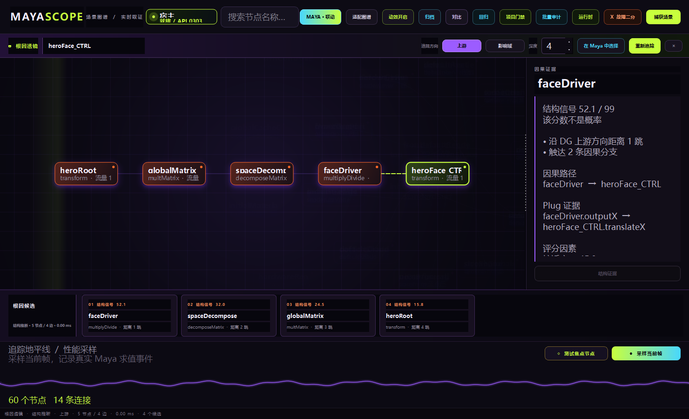
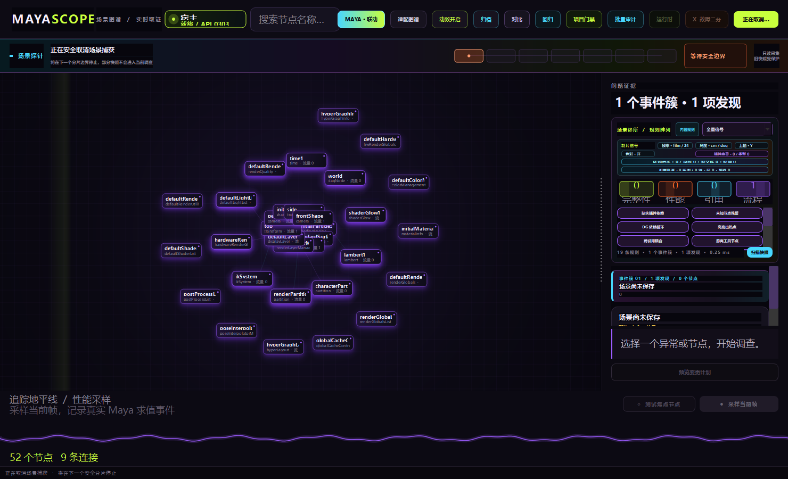

# MayaScope 3.0 Showcase

## 发布包

`python -m MayaScope.release build <output>` 生成确定性 Maya 2025 ZIP 和独立 JSON Manifest。
ZIP 内每个运行时与展示文件都有 size + SHA-256；验证器拒绝重复路径、目录逃逸、缺失文件、
哈希漂移和任何未进入 Manifest 的额外内容。

```powershell
python -m MayaScope.release verify MayaScope-3.0.0-dev-Maya2025.zip
```

发布包只包含运行时 Python、产品文档、声明式示例和 Showcase，不包含 tests、legacy、
MEL 研究仓、缓存或开发工作目录。

## 展示场景

`examples/build_showcase_scene.py` 由隐藏 Maya 2025 Standalone 生成：

- `mayascope_showcase.ma`：156 节点、176 条捕获边的主场景；
- `mayascope_showcase_prop.ma`：用于 loaded / unloaded Reference 的引用资产；
- `mayascope_showcase.json`：场景与引用哈希、Focus 节点、预期信号和演示步骤。

场景包含有意设计、但不会执行危险代码的诊断信号：72 路 fan-out、孤立 Utility、孤立动画
曲线、空操作 Runtime Script node、四层 Namespace、一条 loaded Reference、一条 unloaded
Reference，以及可安全运行 nodeState Counterfactual 的 `showcase_bend`。

真实 MayaScope 重采集已经验证以下规则全部命中：

```text
high-fanout
namespace-depth
orphan-animation-curves
orphan-utilities
runtime-script-nodes
unloaded-references
```

场景还形成一条真实 DG cycle，因此最终 Clinic 结果为 7 项。Runtime Script 内容只有 MEL
注释；打开和 Runner Probe 都应使用 `executeScriptNodes=False`。

## 推荐演示路径

1. 打开主场景，启动 MayaScope；顶部宿主信标应显示 `宿主 2025 / 就绪`。
2. 确认 **MAYA · 联动** 开启；在 Maya Outliner 选择 `showcase_bend`，图谱应在 45 ms 去抖后自动聚焦；再点击 Atlas 中另一节点，Maya 选择应同步变化。
3. `捕获场景` 后切换全量信号、绑定手术、动画脉冲与发布入口。
4. 聚焦 `showcase_bend`，展示根因透镜，再运行 `采样当前帧` 与时间窗拖选。
5. 点击 `测试焦点节点`，展示 AB/BA、bootstrap 区间和 state/Undo 恢复回执。
6. 归档当前快照，修改一个 fan-out probe 后重新捕获，展示差异场。
7. 故障棱镜只针对该场景的可丢弃副本演示；确认 `.ma` pre-open、串行 hidden Probe、
   Journal resume 和 Repro Capsule，不在唯一展示文件上制造故障。

## 根因透镜黄金路径

`examples/generate/lens_chain_scene.py` 在 Maya 2025 中生成并保存一个确定性的绑定驱动夹具：

```text
heroRoot → globalMatrix → spaceDecompose → faceDriver → heroFace_CTRL
                                                    ↘ secondaryFace_CTRL
```

聚焦 `heroFace_CTRL` 后选择“上游”，Atlas 会把四级候选按 DG 距离重排为水平因果走廊。底部候选带
同步展示结构信号与跳数；默认选中的 `faceDriver` 在右侧展示精确的
`faceDriver.outputX → heroFace_CTRL.translateX`。评分明确不是概率，只有接入真实 Profiler 后才显示
实测事件、包含耗时和覆盖率，而且仍不冒充预计优化收益。




真实宿主回归使用 `--scenario lens`。它只操作测试器创建并精确持有的 Maya，现场生成夹具、保存后
捕获、执行追踪、截图，再验证重复启动、热重载、回调释放和退出；启动前已有 Maya 不会被附着或关闭。

## 场景捕获安全取消演示

点击“捕获场景”后再次点击即可请求取消。顶部“场景探针”不是装饰进度条：七段光谱对应真实分片
阶段，取消态会转为橙色并明确提示“等待安全边界”。控制器只会在分片边界退出，未完成的节点、边和
引用不会拼成半张快照；上次有效快照继续支撑 Atlas 与调查证据。捕获期间 Runtime、诊所和性能入口
统一锁定，释放会话后一次恢复。




真实宿主回归使用 `--scenario capture-cancel`。回执同时核对旧快照对象、Maya modified 状态、控制器
释放、入口恢复、重复启动、热重载和全部计时器清理；测试器只回收自己精确创建的 Maya 进程。

## 场景制片契约演示

将 `MAYASCOPE_CLINIC_CONFIG` 指向 `examples/clinic.team.json` 后启动。诊所顶部的“制片信号”带会
实时显示时间单位/帧率、线性与角度单位、上轴和色彩管理；鼠标停留可查看渲染空间、视图变换与
OCIO 配置。示例契约允许 film / 23.976fps、要求 cm / deg / Y-up 和启用色彩管理。

`scene-contract-probe.ma` 故意使用 pal / 25fps、m、rad。隐藏 Maya 2025 发布审计应产生一条
`场景制片规范不一致`，退出码为 2，且没有规则失败。展示证据为
`mayascope-scene-contract.png`、`mayascope-scene-contract-visual.json` 与
`scene-contract-audit.json`。

同一截图还包含橙色风险态 `依赖 · 1 / 缺 1`。`external-dependency-probe.ma` 的 file 节点指向
不存在的 `hero_diffuse.<UDIM>.exr`；发布入口应输出一条 `外部文件依赖缺失`，证据保留节点稳定
身份、属性、原始/解析路径和 `<UDIM>`，完整签名报告为 `external-dependency-audit.json`。

离屏展示场景本身尚未保存，因此同一条制片信号带会显示橙色 `制片信号 · 未保存`，Clinic 产生
`场景存在未保存修改`。真实发布 Audit 打开已保存夹具时 `scene_lifecycle.modified=false`，证明
界面风险态不是固定装饰；后台演示建议显式传 `--workspace` 并展示报告中的 `workspace_source`。

## 项目发布列车演示

运行 `python -m MayaScope.examples.generate.project_gate_fixture D:\MayaScopeDemo\项目门禁`。
生成器会创建三个轻量 Maya ASCII 2025 场景和三份 Scene Clinic 签名回执，再由生产
`build_project_audit` 与 `verify_project_audit` 生成、复核 `project-audit-showcase.json`。
结果必须为 3 个场景、2 个通过、1 个阻断和 2 个原子 Finding；镜头 020 的缓存缺失是唯一阻断项，
镜头 030 的插件登记漂移只是警告。`fixture-manifest.json` 保存场景、回执校验值与预期结论。

在工作区点击 **项目门禁** 打开该包，底部动态“项目发布列车”出现绿、橙、绿三个审计舱。聚焦
镜头 020 后，问题证据栏应展示短场景名、严重级统计及场景/项目签名摘要。真实 Maya 2025 截图
`mayascope-project-gate.png` 和 `mayascope-project-gate-narrow.png` 分别覆盖 1480 × 900 与
800 × 900；对应 lifecycle JSON 证明双层签名、2/1 结论、modified 状态不变及宿主完整退出。

批量队列的实证使用 `mayascope-project-plan.json`：第一次执行加 `--max-scenes 1`，得到
`mayascope-project-queue-paused.json`，状态应为“已暂停”、第一场景“阻断”、第二场景“待运行”；
再次执行同一命令但移除 `--max-scenes`，应只运行第二场景，并生成
`mayascope-project-queue-audit.json`。两个场景的 attempts 都必须为 1，证明恢复没有重复审计。

暂停态视觉证据为 `mayascope-project-queue-paused.png` 与
`mayascope-project-queue-visual.json`：发布列车一节橙色阻断、一节紫色待运行，右侧主动作显示
“继续队列”，问题证据栏显示尚未运行场景的源 SHA 与“审计报告签名：尚未生成”。

生产防护演示使用 `mayascope-project-plan-guarded.json`。运行态截图
`mayascope-project-queue-guarded-running.png` 必须同时展示容量余量、真实后台 Maya PID 与
“崩溃联动开启”；安全暂停后的 `mayascope-project-queue-guarded-live.json` 应为一项阻断、一项
待运行，并通过计划签名校验。`mayascope-process-guard-evidence.json` 记录两项独立实证：并发竞争者
被内核锁拒绝且释放后可重新取得；由测试脚本亲自启动并登记精确身份的 Maya 2025 mayapy 孤儿被
恢复器终止，终止后身份查询为空。该测试不会扫描或终止用户的其他 Maya 进程。

## 插件幽灵因果诊断

打开 `examples/unknown-plugin-probe.ma`。这是自行编写的纯文本 Maya 2025 夹具，故意声明不存在的
`studioGhostTools 4.7` 和 `studioGhostSolver` 节点类型，不包含第三方资产。Maya 把
`ghostSolver1` 降级为 unknown 后，MayaScope 应产生一个合并事件簇：

- **场景依赖的插件缺失**：根因证据包含插件/版本、注册类型和关联未知节点；
- **未知节点残留**：结果证据包含原插件 `studioGhostTools`、原始类 `studioGhostSolver`；
- Atlas 中 `ghostSolver1` 变为橙色焦点，右侧只读证据明确说明不会自动加载或替换插件；
- 两层制片信号阵列显示 `插件幽灵 · 1 / 类型 1`，点击后定位对应规则。

真实 Maya 2025 + PySide6 离屏截图为 `mayascope-plugin-ghost-signal.png`，结构化交互回执为
`mayascope-plugin-ghost-visual.json`，签名发布报告为 `unknown-plugin-audit.json`。报告应为
`gate_failed=true`、worker 退出码 2、规则异常 0，并可独立复算 `report_sha256`。

## 引用轨道与 namespace 归属

打开 `examples/reference-health-probe.ma`。夹具故意把同一个不存在的
`missing/reference-health-asset.ma` 引用两次，并创建本地 `assetA:localIntruder`。MayaScope 应显示：

- `引用轨道 · 2 实例 / 1 源 · 缺 2 · 越界 1`，证明 `{1}` 被识别为实例编号而非第二个文件；
- **引用源文件缺失** 把两个 reference node 归并为一个源文件 atomic finding；
- **本地节点侵入引用命名空间** 精确关联 `assetA:localIntruder`；
- 点击引用轨道后自动打开最高风险证据，并将越界节点作为同一引用因果域点亮；
- 右侧明确说明 UNC 网络路径不会在 Maya 主线程主动探测。

真实 Maya 2025 + PySide6 截图为 `mayascope-reference-orbit.png`，结构化回执为
`mayascope-reference-orbit-visual.json`，签名发布报告为 `reference-health-audit.json`。夹具不包含
真实资产文件，Maya 的缺失引用警告属于预期失败路径。

## 依赖谱系与序列缺口

打开 `examples/dependency-sequence-probe.ma`，点击制片信号阵列中的 **依赖谱系**：

- 信号显示 `2 / 序列 2 · 缺文件 0 · 缺帧 1`；
- `heroUdim` 显示 1001/1002 两个真实成员，不产生伪缺口；
- `plateSequence` 显示 0001–0003 已观测跨度中缺少 0002；
- 点击信号后规则阵列定位 **缓存与序列缺帧**，Atlas 点亮 `plateSequence`；
- Evidence Rail 明确展示“不推断首尾帧、网络和超预算目录保持未知”的安全边界。

真实 Maya 2025 + PySide6 截图为 `mayascope-dependency-lineage.png`，结构化回执为
`mayascope-dependency-lineage-visual.json`，签名报告为 `dependency-sequence-audit.json`。

## Maya 入口

第一次 `launch.run("workspace")` 会安装一个幂等的会话级 MayaScope 主菜单，不写 Preferences。
需要 Shelf 时必须显式选择是否持久化：

```python
from MayaScope.maya_integration import install_shelf
install_shelf()                 # 仅当前会话
install_shelf(persist=True)     # 用户明确要求后才写 Shelf
```

## Runtime Constellation

`runtime_audit_fixture.ma` 是独立的 execution-surface fixture，包含一个 always-evaluate expression
和一个不会在 Audit 打开阶段执行的 scriptNode。对应签名报告为 `runtime-audit-evidence.json`。

`runtime_constellation_wide.png` / `runtime_constellation_narrow.png` 来自真实 Maya 2025 离屏
Workspace：测试只在内存副本临时增加 1 个 expression 和 1 个 node callback，不保存原 Showcase；
四条轨道真实显示 1 expression、0 batch scriptJob、2 loaded plugins 和 1 callback node。
